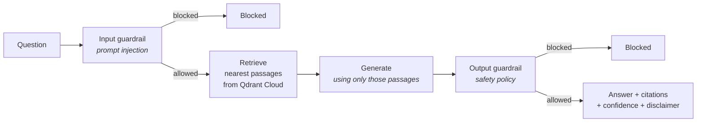

# PulseRAG

**Clinical guideline question answering grounded in a curated corpus.**

> **Not a medical device.** PulseRAG is an educational evidence assistant. It does not diagnose, prescribe, replace a clinician or guarantee that its corpus is complete or current.

---

## How it works



The model supplies language, not facts. Wrong or outdated guidance is corrected by changing the corpus, not by retraining — and because every claim is supposed to trace to a retrieved passage, *groundedness* is directly measurable.

Everything runs in **one Streamlit process**: the dashboard calls the engine directly, and the guardrails wrap every question asked in it. The vector index lives in a free Qdrant Cloud cluster; embeddings, answers and guardrails are hosted APIs.


---

## Documentation

| | |
|---|---|
| [High-Level Design](docs/HLD.md) | Architecture, flows, safety model, trade-offs, implementation plan |
| [Low-Level Design](docs/LLD.md) | Every module at function level |


---


## Run it locally

Local runs use the same Qdrant Cloud cluster the hosted app uses. Nothing runs locally except the Streamlit app itself.

```bash
uv sync                                      # install dependencies
cp .env.example .env                         # then put your keys in .env
uv run streamlit run streamlit_app.py        # http://localhost:8501
```

The first time, open the **Sources** tab and click **Rebuild index now**.

---

## Safety

Two properties to understand before sharing the URL:

- **Guardrails fail open.** A provider outage lets questions through unchecked, logged but not blocked. This is a deliberate availability trade-off. 
- **An unset `GROQ_API_KEY` silently disables both guards.** The dashboard's Guardrails tab shows *Inactive* in that state. Check it after every deploy.
