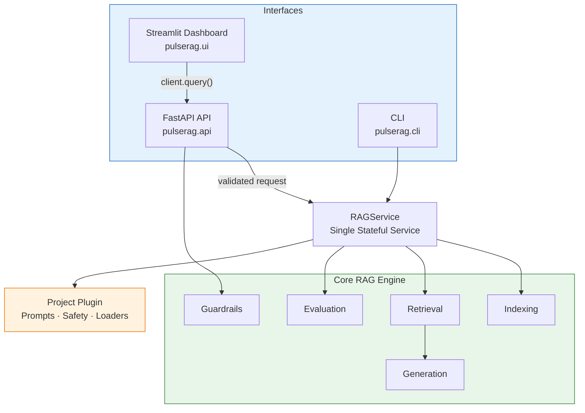

# High-Level Design

---

## 1. Purpose

PulseRAG answers questions about published clinical guidance using only an indexed corpus of source documents. Every answer returns the passages behind it, a confidence grade derived from retrieval scores and a disclaimer. Safety guardrails check the question before any work is done and the drafted answer before it is shown.

---

## 2. Platform Architecture

PulseRAG is designed as a **layered application**.

### Architecture Overview

