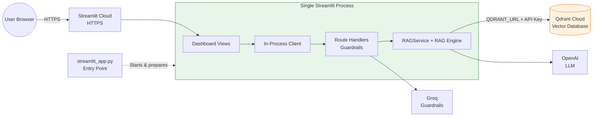
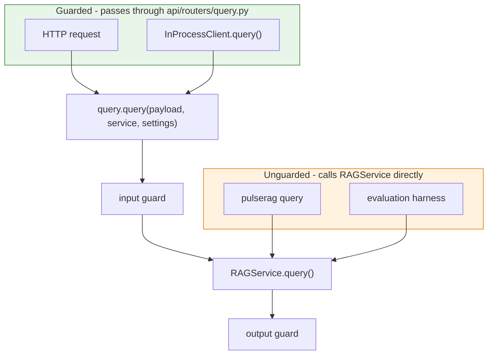
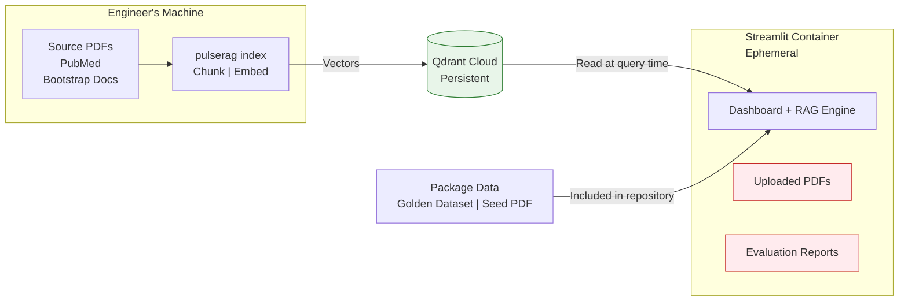
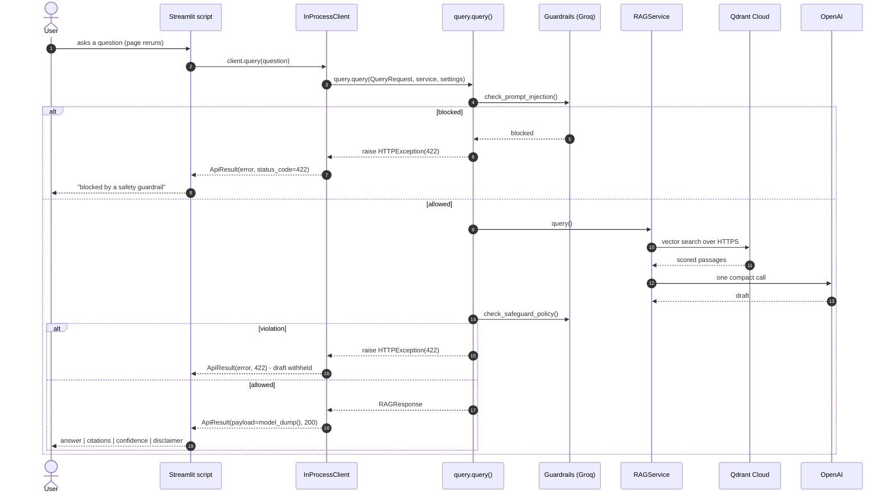
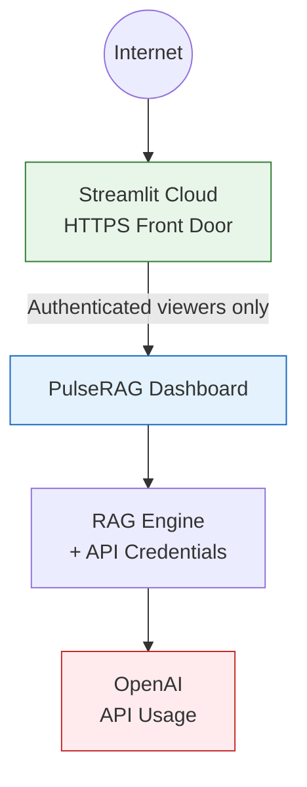

# High-Level Design

---

## 1. Purpose

PulseRAG answers questions about published clinical guidance using only an indexed corpus of source documents. Every answer returns the passages behind it, a confidence grade derived from retrieval scores and a disclaimer. Safety guardrails check the question before any work is done and the drafted answer before it is shown.

---

## 2. Platform Architecture

PulseRAG is designed as a **layered application**.

### Architecture Overview

---

## 3. Design Overview

Running the PulseRAG dashboard and RAG application inside a single Streamlit process, while keeping external services such as Qdrant, OpenAI and Groq hosted separately.

---

## 4. Guardrail Boundary

Guardrails are enforced in the API route handlers and only there. 

- **Guardrails fail open.** If the Groq classifier is unreachable, the request proceeds unchecked and a warning is logged a deliberate availability trade-off.

---

## 5. Where the Data Lives

The Streamlit container uses **ephemeral storage** (means: files written to the container's local disk can disappear when the application restarts or is redeployed). 

| State| Where | Survives restart? |
| --- | --- | ---- | 
| **Vectors**| Qdrant Cloud | Yes |
| **Golden dataset, seed PDF**  | Inside the package | Yes |
| **Uploaded PDFs** | Container disk | **No** |
| **Evaluation reports** | Container disk | **No** |

---

## 6. Request flow

---

# 7. Security Boundary and Access Control

The single-process deployment does **not** use a reverse proxy or a separate API server. The entire PulseRAG application runs behind the public HTTPS endpoint provided by Streamlit Cloud. This makes the Streamlit application's access control the **primary external security boundary**.

