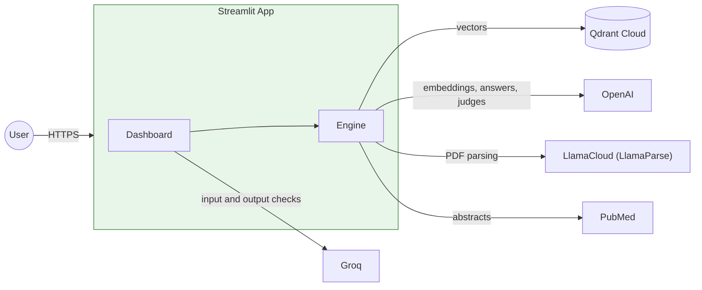

# High-Level Design: PulseRAG
---

## 1. Purpose

PulseRAG answers questions about published clinical guidance using only an indexed corpus of source documents. Every answer comes with the passages behind it, a confidence grade derived from retrieval scores and a disclaimer. Safety guardrails check the question before any work is done and the drafted answer before it is shown. A golden-dataset evaluation measures whether the answers stay grounded as the corpus, prompt or model changes.

> Not a medical device. PulseRAG is an educational evidence assistant. It does not diagnose, prescribe, replace a clinician or guarantee that its corpus is complete or current.
---

## 2. System Context

---

