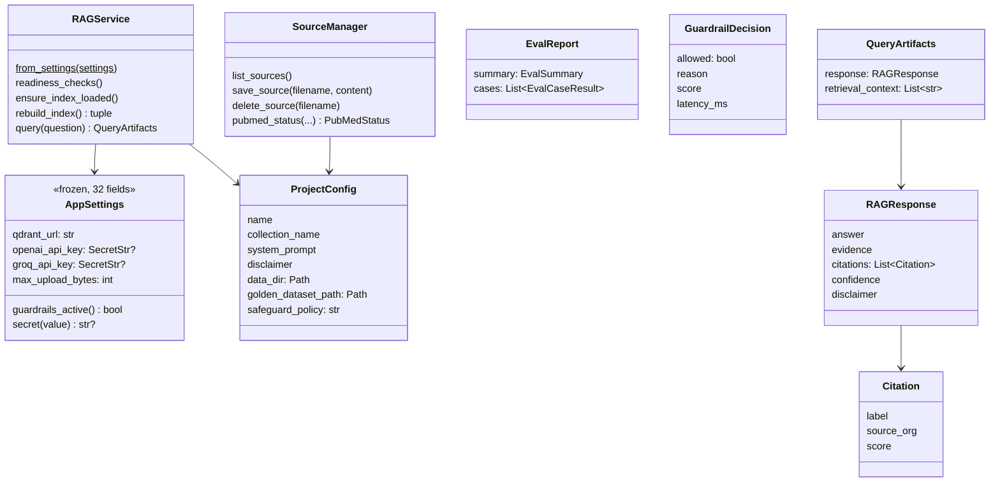

# Low-Level Design: PulseRAG

---

## 1. Code map

```text
PulseRAG/
├── .python-version            Python 3.14 for uv
├── pyproject.toml             project name + libraries
├── .gitignore                 keeps .env, .venv and uploads out of Git
├── .env.example               template for keys
├── streamlit_app.py           Entry Point
└── src/pulserag/              FIRST BUILDING
    ├── __init__.py            PACKAGE_ROOT
    ├── core/
    │   ├── __init__.py        list of core modules
    │   ├── settings.py        AppSettings, get_settings()
    │   ├── logging.py         configure_logging()
    │   ├── exceptions.py      named errors
    │   ├── schemas.py         Citation, RAGResponse, ReadinessCheck
    │   ├── project.py         the plugin template
    │   ├── registry.py        name -> plugin lookup
    │   ├── indexing.py        Qdrant, build and load the index
    │   ├── retrieval.py       search + LLM settings
    │   ├── generation.py      citations, evidence, confidence
    │   ├── service.py         RAGService
    │   ├── guardrails.py      Check Prompt Injection and Safeguard Policy
    │   ├── sources.py
    │   └── evaluation/
    │       ├── metrics.py
    │       └── runner.py
    ├── projects/pulserag/     SIDE BUILDING: the medical plugin
    │   ├── config.py          prompt, disclaimer, collection name
    │   ├── ingestor.py        loads PDF, PubMed, seed documents
    │   ├── data/guidelines/   WHO_BP.pdf
    │   └── datasets/          golden_dataset.json
    └── ui/
        ├── app.py             page frame, status strip, tabs
        ├── formatting.py 
        └── views/
            ├── query.py       Ask Questions tab
            ├── sources.py     Sources tab (Rebuild button)
            ├── evaluations.py Evaluations tab 
            └── guardrails.py  
```

---

## 2. Data model

